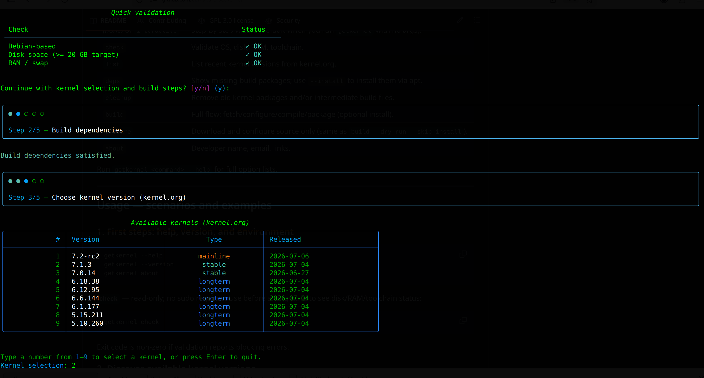
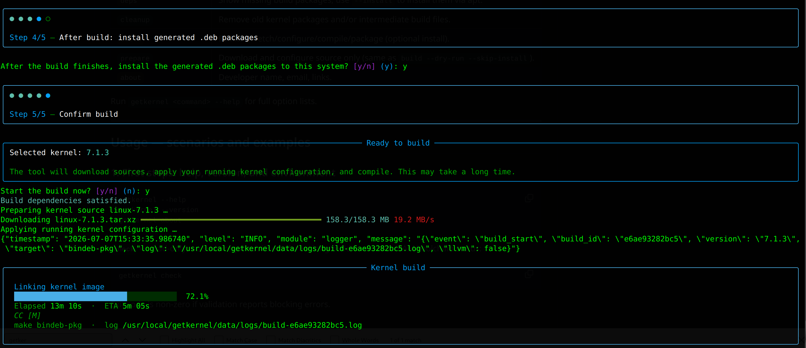
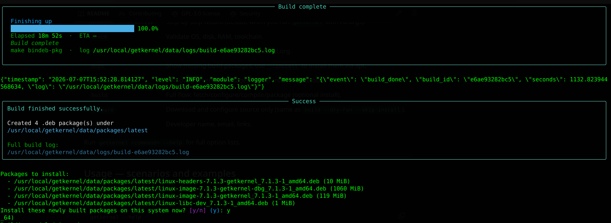
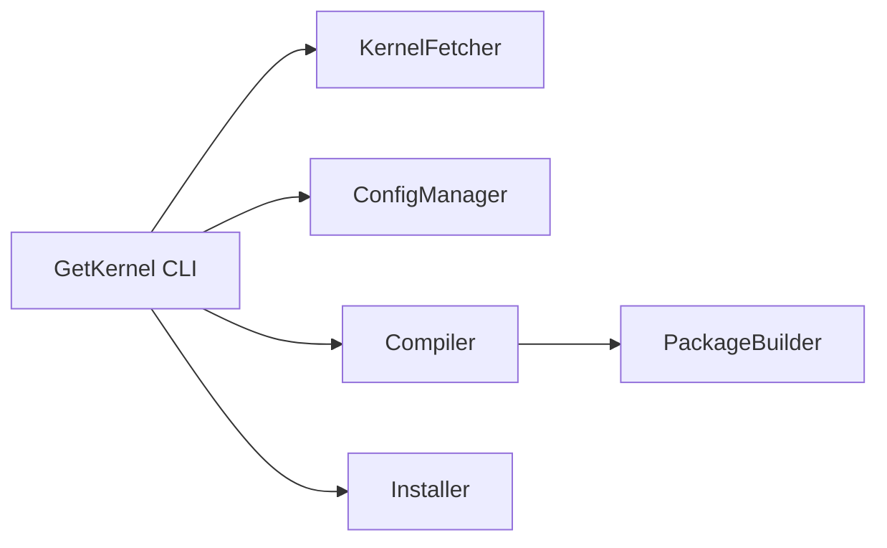

# GetKernel

<p align="center">
  
</p>
<p align="center">
  
</p>
<p align="center">
  
</p>

[](https://github.com/cumakurt/GetKernel/actions/workflows/ci.yml)
[](https://www.gnu.org/licenses/gpl-3.0)
[](https://www.python.org/downloads/)

Python tool for Debian-based systems to list kernels from kernel.org, optionally download sources, reuse your running kernel configuration, build `bindeb-pkg` / `deb-pkg` kernel packages, and install them with backup hooks.

## Requirements

- Python 3.8+
- Debian/Ubuntu/Kali and similar (dpkg/apt)
- Root or sudo for dependency install, build output to system paths, and package installation

## Install

Quick install (copies the project to `/usr/local/getkernel`, creates a venv there, installs from `pyproject.toml`):

```bash
cd GetKernel
chmod +x install.sh   # once, if needed
sudo ./install.sh     # optional: sudo ./install.sh --dev  (pytest, etc.)
```

**Root is required.** If you run `./install.sh` without `sudo`, the script re-runs itself with `sudo` and asks for your password.

If older GetKernel files are found (previous install dir, symlinks, or shell PATH blocks), the installer lists them and asks for confirmation before removal. Use `--yes` to skip that prompt.

The installer places files under **`/usr/local/getkernel`** and adds **`/usr/local/bin/getkernel`** to your PATH (available to all users with `/usr/local/bin` on `PATH`).

After installation, kernel downloads, build trees, logs, and package output are stored under `/usr/local/getkernel/data/` (cache, builds, logs, packages).

To skip the global symlink: `sudo ./install.sh --no-symlink` (then use `source /usr/local/getkernel/.venv/bin/activate` or `/usr/local/getkernel/.venv/bin/getkernel`).

Manual install:

```bash
cd GetKernel
python3 -m venv .venv
source .venv/bin/activate
pip install -e .
# optional dev deps (pytest): pip install -e ".[dev]"
```

Metadata and dependencies are defined in `pyproject.toml` (setuptools). A minimal `setup.py` shim is kept for compatibility.

## Architecture (overview)



- **KernelFetcher**: `kernel.org` metadata and tarball download, cache reuse.
- **ConfigManager**: seeds `.config` from the running kernel or a file you pass, then `make olddefconfig` / `prepare`.
- **Compiler**: `make` targets (`bindeb-pkg` by default); full build log written under `data/logs/build-<id>.log` with a terminal summary.
- **PackageBuilder**: finds `linux-*.deb`, copies to `data/packages` (or `--output-dir`).
- **Installer**: optional `dpkg` + `apt-get install -f`, initramfs/grub.

## Global CLI options

These apply before the subcommand:

| Option | Meaning |
|--------|---------|
| `--help` / `-h` | Show help for `getkernel` or a subcommand. |
| `--version` | Show version and author line. |
| `--yes` / `-y` | Assume yes for **post-build installation** prompts (dpkg install), for non-interactive use. |

## Commands reference

| Command | Purpose |
|---------|---------|
| *(none)* or `interactive` | Step-by-step wizard (default when you run `getkernel` with no args). |
| `check` | Validate OS, disk, RAM, toolchain. |
| `list` | List recent kernel versions from kernel.org. |
| `deps` | Show missing build packages; use `--install` to install them via apt. |
| `cleanup` | Remove old kernel packages and/or intermediate build files. |
| `build` | Full flow: fetch/configure/compile/package (optional install). |
| `prepare` | Download and configure source only (same as `build --dry-run --skip-install`). |
| `about` | Developer name, email, links. |

Run `getkernel <command> --help` for full option lists.

---

## Usage — scenarios and examples

### 1. First steps: help, version, and environment

```bash
getkernel --help
getkernel --version
getkernel about
```

**`check`** — read-only; no sudo required. Use before a long build to see disk/RAM/toolchain status:

```bash
getkernel check
```

Exit code is non-zero if validation reports blocking errors.

### 2. Discover available kernel versions

```bash
getkernel list
```

Hide release candidates (only stable/mainline as listed by the tool):

```bash
getkernel list --no-rc
```

### 3. Build dependencies

List what is missing (no root needed if you only inspect):

```bash
getkernel deps
```

Install everything the tool needs for building (requires root/sudo):

```bash
sudo getkernel deps --install
```

### 4. Interactive wizard

Recommended for guided use. If you are not root, the UI typically asks to re-run with `sudo`:

```bash
python3 GetKernel.py
# or explicitly:
getkernel interactive
```

To **skip automatic sudo re-exec** (e.g. automated tests — not for normal desktop use):

```bash
GETKERNEL_NO_ELEVATE=1 python3 GetKernel.py
```

### 5. Full build with default config (from running kernel)

Pick a version from `getkernel list`, then:

```bash
sudo getkernel build --version 6.12.8
```

After a successful build you get a summary and a prompt to install the `.deb` packages (default **yes** — Enter confirms, `n` skips).

### 6. Build but do not install (only produce `.deb` files)

```bash
sudo getkernel build --version 6.12.8 --skip-install
```

Useful when you want to copy packages elsewhere or install manually later. Built packages are collected under `data/packages/` (see success output for `latest/`).

### 7. Prepare source only (no compile)

Download/configure the tree; no `make` package build:

```bash
sudo getkernel prepare --version 6.12.8
```

Equivalent idea:

```bash
sudo getkernel build --version 6.12.8 --dry-run --skip-install
```

### 8. Non-interactive workflows

**Auto-confirm installation** after build (no prompt):

```bash
sudo getkernel --yes build --version 6.12.8
```

Or via environment (same effect for install approval):

```bash
GETKERNEL_ASSUME_YES=1 sudo -E getkernel build --version 6.12.8
```

Note: `--yes` / `GETKERNEL_ASSUME_YES` affect the **dpkg install** step after build, not every question in the interactive wizard.

### 9. Custom kernel configuration

Use a saved `.config` instead of cloning options from the running kernel:

```bash
sudo getkernel build --version 6.12.8 --config /path/to/.config
```

`prepare` also accepts `--config` when you only want a prepared tree:

```bash
sudo getkernel prepare --version 6.12.8 --config /path/to/.config
```

### 10. Config fragments (Kconfig snippets)

Merge one or more fragment files after the base config (uses the kernel tree’s `scripts/kconfig/merge_config.sh`):

```bash
sudo getkernel build --version 6.12.8 \
  --fragment /path/to/extra.cfg \
  --fragment /path/to/more.cfg
```

You can list paths under `build.config_fragments` in `config/user_config.yaml` (see `config/fragments/example-debug.cfg`).

### 11. `localmodconfig` (smaller config, modules you actually load)

Trims configuration to modules currently loaded on this machine (`make localmodconfig`):

```bash
sudo getkernel build --version 6.12.8 --localmodconfig
```

Also available on `prepare`:

```bash
sudo getkernel prepare --version 6.12.8 --localmodconfig
```

### 12. LLVM / Clang build

Install `clang` and `llvm` first, then:

```bash
sudo getkernel build --version 6.12.8 --llvm
```

Or set `build.use_llvm: true` in `config/user_config.yaml`.

### 13. Build progress on the terminal

By default, GetKernel shows a **live progress panel** (current phase, percent bar, ETA, last activity). Full `make` output is always written to `data/logs/build-<id>.log`.

Stream all `make` lines to the terminal:

```bash
sudo getkernel build --version 6.12.8 --verbose
```

Minimal output (no progress panel; log file only):

```bash
sudo getkernel build --version 6.12.8 --quiet
```

### 14. Custom output directory for `.deb` packages

```bash
sudo getkernel build --version 6.12.8 --output-dir /path/to/debs
```

`prepare` accepts `--output-dir` for informational consistency with where packages would go after a full build.

### 15. Existing source tree (skip download)

Point to an already extracted `linux-*` directory with a `Makefile`:

```bash
sudo getkernel build --version 6.12.8 --source-dir /path/to/linux-6.12.8
```

Use the version string that matches that tree so packaging metadata stays consistent.

### 16. Reusing packages from a previous build

If you run `getkernel build --version X` again and matching packages are already under `data/packages/latest/` (from `build-info.json`), GetKernel **detects** them and offers:

- **[r]ebuild** — full compile again (default),
- **[q]uit** — exit.

Stored depot packages are **not** offered for installation. After a fresh build, the install prompt applies only to the **newly built** `.deb` files.

This reuse check is **skipped** when you pass `--source-dir`, `--config`, `--fragment`, `--llvm`, `--localmodconfig`, or `--force-rebuild`.

**Non-interactive default:** rebuilds when stored packages exist.

**Force a full rebuild** regardless of cached packages:

```bash
sudo getkernel build --version 6.12.8 --force-rebuild
```

### 17. Cleanup: old kernels and build artifacts

Remove old kernel **packages** from the system (keeps running kernel + `--keep` newest; default `--keep 2`):

```bash
sudo getkernel cleanup --old-kernels
```

Preview without deleting:

```bash
sudo getkernel cleanup --old-kernels --dry-run
```

Keep more than two older kernels:

```bash
sudo getkernel cleanup --old-kernels --keep 4
```

Remove intermediate files under `data/builds` (per extracted source tree), keeping produced packages:

```bash
sudo getkernel cleanup --build-artifacts
```

Both flags can be combined in one run.

### 18. Privileges summary

| Activity | Typical privilege |
|----------|-------------------|
| `check`, `list`, `deps` (without `--install`), `about`, `--help` | Normal user |
| `build`, `prepare`, `deps --install`, `cleanup`, interactive build steps | **root or sudo** |

Read-only commands do not need elevation. Build/install paths and `apt`/`dpkg` expect administrator rights.

## Configuration

- `config/default_config.yaml` — defaults shipped with the project.
- `config/user_config.yaml` — optional; merged on top of defaults (create from `config/user_config.yaml.example`).

Notable keys: `paths.*`, `kernel.localversion`, `kernel.reuse_downloads`, `build.jobs`, `build.target`, `build.use_llvm`, `build.localmodconfig`, `build.config_fragments`, `dependencies.auto_install`, `dependencies.install_optional`.

## Environment variables

| Variable | Effect |
|----------|--------|
| `GETKERNEL_ASSUME_YES=1` | Same family as `--yes`: auto-confirm **install** after build. |
| `GETKERNEL_ROOT` | Override install/data root (default: `/usr/local/getkernel` when installed via `install.sh`). |
| `GETKERNEL_NO_ELEVATE=1` | Do not re-exec with sudo (testing / special setups only). |

## Known limitations

- **`deb-pkg`** on a tarball tree without `.git` is automatically switched to **`bindeb-pkg`** (upstream `make` requires a git checkout for source packages).
- **Cross-compilation** is not handled; the tool assumes a native toolchain on the build host.
- **Disk paths** under `data/` are resolved from the install root (`/usr/local/getkernel` after `install.sh`); adjust `paths` in YAML or use CLI flags where available.

## Disclaimer and user responsibility

GetKernel automates steps that **modify your system** (packages, `/boot`, initramfs, GRUB, module trees). **You alone** decide whether a kernel version, configuration, and install path are appropriate for your hardware, workload, and distribution.

- **No warranty**: The software is provided *as is*. The authors and contributors are **not liable** for data loss, boot failures, broken graphics or drivers, security issues, downtime, or any damage arising from use or misuse.
- **Your environment**: Compatibility with **third-party kernel modules** (NVIDIA, VirtualBox, ZFS, vendor out-of-tree drivers, security products, etc.), **DKMS**, and **userland** expectations is **your** responsibility to verify before and after installation.
- **Backups and recovery**: Maintain backups and know how to recover (previous kernel entry in the boot menu, live USB, snapshot/restore) before installing custom kernels.

By using GetKernel, you acknowledge that **risk assessment, testing, and consequences of kernel changes rest entirely with you**.

## Operational warnings (common post-install issues)

These are typical of **any** custom kernel workflow, not bugs in GetKernel itself. They are listed so you can plan ahead.

| Topic | What can happen |
|--------|------------------|
| **DKMS** | Installing `linux-image` triggers `/etc/kernel/postinst.d/dkms`. If **any** registered module fails to build (often **proprietary GPU** drivers on very new or **RC** kernels), the **postinst may fail**, leaving `dpkg` in an error state until you fix dependencies or module builds. |
| **NVIDIA / similar** | Vendor drivers track **older, stable** kernel ABIs. **Linux 7.x / RC / mainline** often changes internal APIs (`mmap`/VMA, locking, symbols). Errors such as *wrong arity for `__is_vma_write_locked`*, *undeclared `VMA_LOCK_OFFSET`*, or similar in `make.log` mean the **driver version is not yet compatible** with that kernel—not something GetKernel can patch for you. |
| **`linux-libc-dev`** | Replacing this metapackage with a version tied to your custom kernel can affect **userland builds** on the same system. Understand the trade-off or use a dedicated build machine. |
| **Secure Boot / signing** | Your firmware, MOK, and signing policy may require extra steps for unsigned or self-signed modules. |
| **Release candidates** | **`-rc`** kernels are **development** snapshots; expect **more breakage** with out-of-tree modules and production use. |

**If DKMS fails:** inspect `/var/lib/dkms/.../build/make.log`, resolve driver/kernel pairing (newer driver, older kernel, alternate stack), then run `sudo dpkg --configure -a` and/or `sudo apt-get install -f` as appropriate. **Do not** assume GetKernel can choose a kernel that guarantees proprietary driver success.

## Development

```bash
pip install -e ".[dev]"
pytest
```

See [CONTRIBUTING.md](CONTRIBUTING.md) for pull requests. Security disclosures: [SECURITY.md](SECURITY.md).

## Author

- **Name:** Cuma KURT  
- **Email:** [cumakurt@gmail.com](mailto:cumakurt@gmail.com)  
- **LinkedIn:** [linkedin.com/in/cuma-kurt-34414917](https://www.linkedin.com/in/cuma-kurt-34414917/)  
- **GitHub:** [github.com/cumakurt/GetKernel](https://github.com/cumakurt/GetKernel)

## License

GPL-3.0
