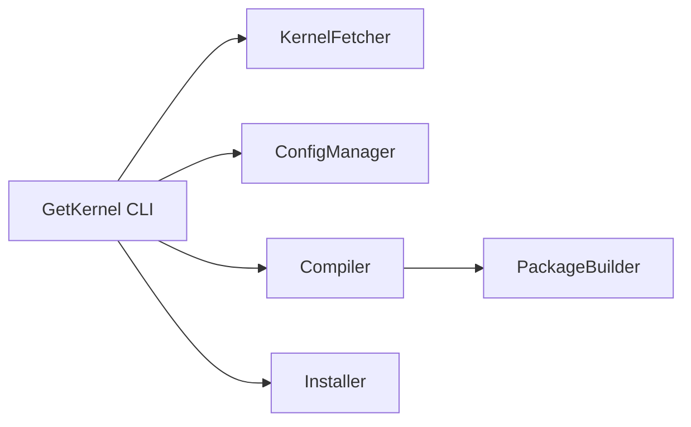

# GetKernel

[](https://github.com/cumakurt/GetKernel/actions/workflows/ci.yml)
[](https://www.gnu.org/licenses/gpl-3.0)
[](https://www.python.org/downloads/)

Build custom Linux kernel `.deb` packages on Debian-based systems: fetch from kernel.org, reuse your running kernel config, compile with live progress, and optionally install with backup hooks.

<p align="center">
  
  
  
</p>

## Quick start

```bash
git clone https://github.com/cumakurt/GetKernel.git
cd GetKernel
sudo ./install.sh
sudo getkernel                    # interactive wizard (default)
# or a direct build:
sudo getkernel build --version 6.12.8
```

## Requirements

- Python 3.8+
- Debian, Ubuntu, Kali, or similar (dpkg/apt)
- Root or sudo for installs, builds, and package deployment

## Installation

System install (recommended):

```bash
sudo ./install.sh              # optional: --dev  --yes  --no-symlink
```

- Installs to **`/usr/local/getkernel`** and links **`/usr/local/bin/getkernel`**
- Runtime data lives under **`/usr/local/getkernel/data/`** (cache, builds, logs, packages)
- Requires sudo; lists and confirms removal of old GetKernel files before upgrading

Development install (local checkout):

```bash
python3 -m venv .venv && source .venv/bin/activate
pip install -e ".[dev]"
```

## Commands

| Command | Purpose |
|---------|---------|
| `getkernel` / `interactive` | Step-by-step wizard (default) |
| `build` | Download, configure, compile, package; optional install |
| `prepare` | Source + config only (no compile) |
| `list` | Kernel versions from kernel.org |
| `check` | OS, disk, RAM, toolchain validation |
| `deps` | Missing build packages (`--install` to apt install) |
| `cleanup` | Old kernel packages and/or build artifacts |
| `about` | Project and author info |

Global flags: `--help`, `--version`, `--yes` / `-y` (auto-confirm post-build install).

Run `getkernel <command> --help` for full options.

## Common workflows

| Goal | Command |
|------|---------|
| Guided build | `sudo getkernel` |
| Full build + install prompt | `sudo getkernel build --version 6.12.8` |
| Build `.deb` only | `sudo getkernel build --version 6.12.8 --skip-install` |
| Prepare tree, no compile | `sudo getkernel prepare --version 6.12.8` |
| Non-interactive install | `sudo getkernel --yes build --version 6.12.8` |
| Custom `.config` | `sudo getkernel build --version 6.12.8 --config /path/.config` |
| Kconfig fragments | `sudo getkernel build --version 6.12.8 --fragment cfg1 --fragment cfg2` |
| Trim to loaded modules | add `--localmodconfig` |
| Clang/LLVM build | add `--llvm` (install clang/llvm first) |
| Existing source tree | `--source-dir /path/to/linux-X.Y.Z` |
| Custom package output | `--output-dir /path/to/debs` |
| Force full rebuild | `--force-rebuild` |
| Clean old kernels | `sudo getkernel cleanup --old-kernels` |
| Clean build junk | `sudo getkernel cleanup --build-artifacts` |

### Build terminal output

| Mode | Flag | Behavior |
|------|------|----------|
| Default | — | Live progress panel (phase, bar, ETA); full log in `data/logs/build-<id>.log` |
| Verbose | `--verbose` / `-v` | Stream all `make` output |
| Quiet | `--quiet` / `-q` | Minimal output; log file only |

`--quiet` and `--verbose` cannot be used together.

### Stored packages

If matching `.deb` files already exist under `data/packages/latest/`, GetKernel offers **rebuild** or **quit** only — depot packages are not offered for install. The install prompt appears only after a **fresh** build. Skip this check with `--force-rebuild` or when using `--config`, `--fragment`, `--llvm`, `--localmodconfig`, or `--source-dir`.

## Privileges

| Activity | Privilege |
|----------|-----------|
| `check`, `list`, `deps`, `about`, `--help` | Normal user |
| `build`, `prepare`, `deps --install`, `cleanup`, wizard | **root / sudo** |

## Architecture



| Module | Role |
|--------|------|
| **KernelFetcher** | kernel.org metadata, tarball download/resume, cache reuse |
| **ConfigManager** | `.config` from running kernel or file; fragments; `olddefconfig` |
| **Compiler** | `make bindeb-pkg` (default); live progress; build logs |
| **PackageBuilder** | Collect `linux-*.deb` → `data/packages/latest/` |
| **Installer** | Optional `dpkg`, `apt-get install -f`, initramfs, GRUB |

Tarball trees without `.git` use **`bindeb-pkg`** automatically (`deb-pkg` needs a git checkout).

## Configuration

Copy `config/user_config.yaml.example` → `config/user_config.yaml` to override defaults from `config/default_config.yaml`.

| Key | Purpose |
|-----|---------|
| `paths.*` | cache, logs, builds, packages directories |
| `kernel.localversion` | suffix appended to kernel release |
| `kernel.reuse_downloads` | skip re-download when tarball/tree exists |
| `build.jobs` | parallel make jobs (`null` = CPU count) |
| `build.target` | `bindeb-pkg` or `deb-pkg` |
| `build.use_llvm` / `build.localmodconfig` | LLVM build; module trimming |
| `build.config_fragments` | Kconfig fragment paths |
| `dependencies.auto_install` | apt install missing build deps before build |

## Environment variables

| Variable | Effect |
|----------|--------|
| `GETKERNEL_ASSUME_YES=1` | Auto-confirm install after build (like `--yes`) |
| `GETKERNEL_ROOT` | Override data/install root |
| `GETKERNEL_NO_ELEVATE=1` | Skip sudo re-exec (testing only) |

## Limitations & warnings

- No cross-compilation support; native toolchain only.
- Custom kernels can break **DKMS**, **NVIDIA**, and other out-of-tree drivers — especially on **RC/mainline** kernels. Check `/var/lib/dkms/.../build/make.log` if postinst fails.
- Replacing **`linux-libc-dev`** may affect userland builds on the same machine.
- **Secure Boot** may require extra steps for unsigned modules.
- **Back up** and know how to boot a previous kernel before installing.

GetKernel modifies packages, `/boot`, initramfs, and GRUB. Use at your own risk; authors provide **no warranty**. See [SECURITY.md](SECURITY.md) for disclosures.

## Development

```bash
pip install -e ".[dev]"
pytest
```

Contributions: [CONTRIBUTING.md](CONTRIBUTING.md)

## Author & license

**Cuma KURT** — [cumakurt@gmail.com](mailto:cumakurt@gmail.com) · [GitHub](https://github.com/cumakurt/GetKernel) · [LinkedIn](https://www.linkedin.com/in/cuma-kurt-34414917/)

Licensed under **GPL-3.0**.
