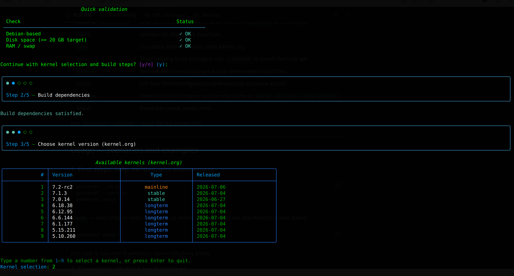
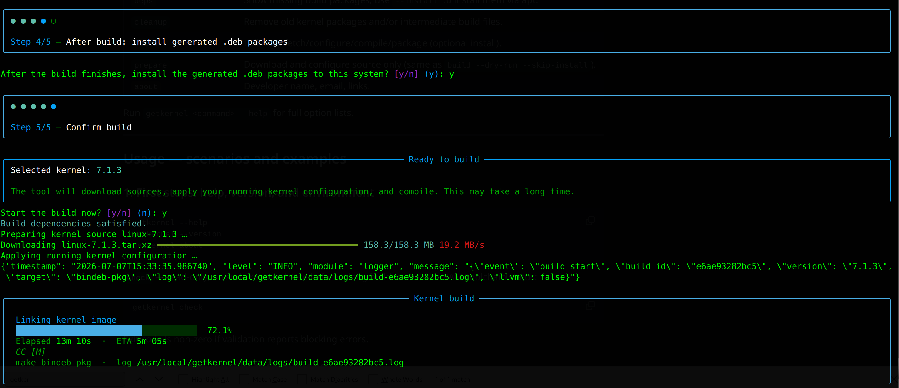
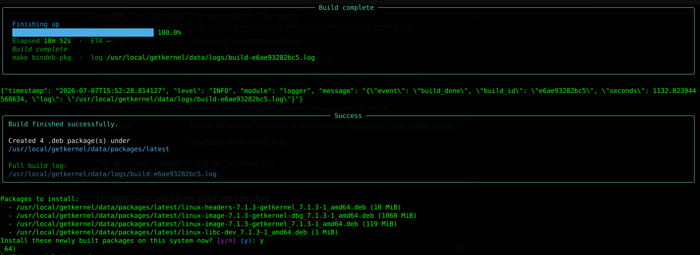
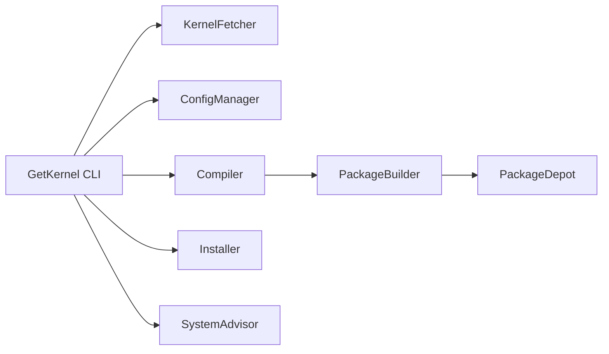

# GetKernel

[](https://github.com/cumakurt/GetKernel/actions/workflows/ci.yml)
[](https://www.gnu.org/licenses/gpl-3.0)
[](https://www.python.org/downloads/)

Build custom Linux kernel `.deb` packages on Debian-based systems: fetch from kernel.org, reuse your running kernel config, compile with live progress, and optionally install with backup and verification hooks.

<p align="center">
  
  
  
</p>

### Reliability and integrity

- kernel.org release metadata is cached for 15 minutes; a stale valid cache keeps version listing available during temporary network failures.
- Complete source trees and verified tarballs are reused. Interrupted downloads resume only when the server confirms the requested byte range; failed mirrors cannot leave a corrupt tail for the next attempt.
- SHA256 verification is **fail-closed by default**. Optional PGP verification checks kernel.org's detached signature against the uncompressed tar stream, as required by the [kernel.org signature guide](https://www.kernel.org/signature.html).
- Archives are extracted through traversal/link protection into a staging directory and published only after a complete kernel source tree is confirmed.
- Package sets are published transactionally with SHA256 manifests. Installation rechecks depot integrity and confirms that `dpkg`/`apt` left every requested runtime package installed.

## Quick start

```bash
git clone https://github.com/cumakurt/GetKernel.git
cd GetKernel
sudo ./install.sh

# Recommended: interactive wizard (default when no command is given)
sudo getkernel

# Advanced: direct build without the wizard
sudo getkernel build --version 6.12.8
```

> **Note:** `sudo ./install.sh` installs the GetKernel **tool**. `sudo getkernel` (alone) starts the **kernel build wizard** — not tool installation.

## Recommended: interactive mode

After installing GetKernel, the easiest way to build a kernel is to run **no subcommand at all**:

```bash
sudo getkernel
```

This is equivalent to `sudo getkernel interactive` and is the **recommended entry point** for most users. The wizard walks you through:

1. System snapshot (running kernel, hardware, loaded modules)
2. Build dependency check (optional apt install)
3. Kernel version selection from kernel.org
4. Whether to install `.deb` packages after the build
5. Build confirmation and live progress

Use direct commands such as `getkernel build --version 6.12.8` only when you already know the version and flags you need (scripts, CI, or advanced workflows).

## Requirements

- Python 3.8+
- Debian, Ubuntu, Kali, or similar (dpkg/apt)
- The standard build toolchain, including `gcc`, `make`, `tar`, `xz`, `dpkg-dev`, kernel build libraries, and packaging tools (`getkernel deps` reports the exact missing packages)
- `gpg` only when `kernel.verify_signature` is enabled
- By default, at least 20 GiB free on the configured build filesystem and 4 GiB RAM (swap contributes partially to the memory check); both thresholds are configurable
- Root or sudo for installs, builds, and package deployment

## Installation

System install (recommended):

```bash
sudo ./install.sh              # optional: --dev  --yes  --no-symlink  --recreate-venv
sudo ./uninstall.sh            # remove /usr/local/getkernel (or: sudo getkernel uninstall)
```

| Path | Purpose |
|------|---------|
| `/usr/local/getkernel` | Program files, config, virtualenv |
| `/usr/local/getkernel/data/cache` | Download cache |
| `/usr/local/getkernel/data/builds` | Kernel source trees and tarballs |
| `/usr/local/getkernel/data/logs` | Build logs (`build-<id>.log`) |
| `/usr/local/getkernel/data/packages/latest/` | Most recent `.deb` output |
| `/usr/local/getkernel/data/packages/archive/build-<id>/` | Archived builds |
| `/usr/local/bin/getkernel` | Symlink to the installed CLI |

### Install and update behavior

- **First install** — copies files to `/usr/local/getkernel` and creates the `getkernel` command.
- **In-place update** — if GetKernel is already at `/usr/local/getkernel`, the installer asks to update on top of the existing install. Program files are refreshed; **`data/cache`, `data/logs`, `data/builds`, and `data/packages` are preserved**.
- **Legacy paths** — installs under a different location (old symlinks, `~/.local/bin/getkernel`, PATH snippets pointing elsewhere) are listed separately. Removal of those files and their data requires **explicit confirmation**; you can skip cleanup and continue the new install.

Non-interactive: use `sudo ./install.sh --yes` to accept update and legacy-cleanup prompts.

Development install (local checkout):

```bash
python3 -m venv .venv && source .venv/bin/activate
pip install -e ".[dev]"
```

## Commands

| Command | Purpose |
|---------|---------|
| `getkernel` / `interactive` | Step-by-step wizard (**default**, recommended) |
| `build` | Download, configure, compile, package; optional install |
| `prepare` | Source + config only (no compile) |
| `list` | Kernel versions from kernel.org (`--json`, `--no-rc`) |
| `check` | OS, disk, RAM, toolchain validation (`--json`) |
| `status` | Running kernel, GRUB, depot, last build log (`--json`) |
| `deps` | Missing build packages (`--install` to apt install) |
| `install` | Install runtime `.deb` packages from depot (`--build-id`, optional `--kernel-version`) |
| `packages list` | List latest and archived builds (`--json`) |
| `backups` | Boot file backups before install (`--json`) |
| `rollback` | Restore a backup by id (`backup-YYYYMMDD-HHMMSS`) |
| `cleanup` | Old kernel packages and/or build artifacts |
| `uninstall` | Remove GetKernel from `/usr/local/getkernel` |
| `about` | Project and author info |

Global flags: `--help`, `--version`, `--yes` / `-y` (auto-confirm install prompts).

Run `getkernel <command> --help` for full options.

## Examples

### Tool install / uninstall

```bash
sudo ./install.sh
sudo ./install.sh --dev
sudo ./install.sh --yes
sudo ./install.sh --recreate-venv
sudo ./install.sh --no-symlink
sudo ./uninstall.sh
sudo getkernel uninstall -y
```

### General CLI

```bash
getkernel --help
getkernel --version
getkernel about
sudo getkernel --yes build --version 6.12.8
GETKERNEL_ASSUME_YES=1 sudo getkernel build --version 6.12.8
```

### Interactive wizard (recommended)

```bash
sudo getkernel
sudo getkernel interactive
```

### `check` — system validation

```bash
getkernel check
getkernel check --json
```

### `list` — kernel.org versions

```bash
getkernel list
getkernel list --no-rc
getkernel list --json
```

### `status` — system and depot overview

```bash
getkernel status
getkernel status --json
```

### `deps` — build dependencies

```bash
getkernel deps
sudo getkernel deps --install
```

### `build` — compile kernel packages

```bash
sudo getkernel build --version 6.12.8
sudo getkernel build --version 6.12.8 --skip-install
sudo getkernel --yes build --version 6.12.8
sudo getkernel build --version 6.12.8 --source-dir /usr/local/getkernel/data/builds/linux-6.12.8
sudo getkernel build --version 6.12.8 --config /path/to/.config
sudo getkernel build --version 6.12.8 --fragment config/fragments/my-tweaks.cfg
sudo getkernel build --version 6.12.8 --profile server
sudo getkernel build --version 6.12.8 --menuconfig
sudo getkernel build --version 6.12.8 --localmodconfig
sudo getkernel build --version 6.12.8 --llvm
sudo getkernel build --version 6.12.8 --resume-build
sudo getkernel build --version 6.12.8 --force-rebuild
sudo getkernel build --version 6.12.8 --output-dir /tmp/my-debs
sudo getkernel build --version 6.12.8 --dry-run
sudo getkernel build --version 6.12.8 --verbose
sudo getkernel build --version 6.12.8 --quiet
```

### `prepare` — source and config only

```bash
sudo getkernel prepare --version 6.12.8
sudo getkernel prepare --version 6.12.8 --config /path/.config
sudo getkernel prepare --version 6.12.8 --fragment cfg1 --localmodconfig
```

### `install` — install from package depot

Installs **runtime packages only** (`linux-image-*`, `linux-headers-*`, `linux-modules-*`). `linux-libc-dev` and debug packages stay archived under `data/packages/`.

When `--kernel-version` is omitted, GetKernel reads `kernel_release` from `build-info.json` (or reconstructs it from `requested_version` + `localversion`).

```bash
sudo getkernel install
sudo getkernel --yes install
sudo getkernel install --build-id a1b2c3d4e5f6
sudo getkernel install --kernel-version 6.12.8
sudo getkernel install --build-id a1b2c3d4e5f6 --kernel-version 6.12.8-custom
```

### `packages list` — depot contents

```bash
getkernel packages list
getkernel packages list --json
```

### `backups` and `rollback`

```bash
getkernel backups
getkernel backups --json
sudo getkernel rollback backup-20260707-155257
ls /var/backups/getkernel/backup-20260707-155257/
cat /var/backups/getkernel/backup-20260707-155257/manifest.json
```

### `cleanup`

```bash
sudo getkernel cleanup --old-kernels
sudo getkernel cleanup --old-kernels --keep 3
sudo getkernel cleanup --old-kernels --dry-run
sudo getkernel cleanup --build-artifacts
sudo getkernel cleanup --old-kernels --build-artifacts
```

### Build terminal output

| Mode | Flag | Behavior |
|------|------|----------|
| Default | — | Live progress panel (phase, bar, ETA); full log in `data/logs/build-<id>.log` |
| Verbose | `--verbose` / `-v` | Stream all `make` output |
| Quiet | `--quiet` / `-q` | Minimal output; log file only |

`--quiet` and `--verbose` cannot be used together.

### Stored packages

If matching `.deb` files already exist under `data/packages/latest/`, `build` offers **rebuild** or **quit**. Install stored packages with **`getkernel install`** (or `install --build-id <id>` for archives under `data/packages/archive/`). The post-build install prompt appears only after a **fresh** build. Skip the rebuild check with `--force-rebuild` or when using `--config`, `--fragment`, `--profile`, `--menuconfig`, `--resume-build`, `--llvm`, `--localmodconfig`, or `--source-dir`.

Each build writes `data/packages/latest/build-info.json` with `requested_version`, `localversion`, and the exact **`kernel_release`** from Kbuild. Package discovery and verification use that release so stale sibling `.deb` files are not picked up.

`latest/` is replaced as one transactional build set only after all packages and metadata are complete. `checksums.sha256` is verified before install—including missing files—and archives use hard links when the filesystem supports them to avoid storing the same large `.deb` payload twice.

After install, GetKernel verifies `/boot/vmlinuz-*`, `/lib/modules/<release>/`, and `/lib/modules/<release>/build` (headers symlink) when a kernel release hint is available.

## Privileges

| Activity | Privilege |
|----------|-----------|
| `check`, `list`, `status`, `packages list`, `backups`, `deps`, `about`, `--help` | Normal user |
| `build`, `prepare`, `install`, `deps --install`, `cleanup`, `rollback`, `uninstall`, wizard | **root / sudo** |

## Architecture


```mermaid
flowchart LR
  CLI[GetKernel CLI]
  KF[KernelFetcher]
  CM[ConfigManager]
  CO[Compiler]
  PB[PackageBuilder]
  PD[PackageDepot]
  IN[Installer]
  SA[SystemAdvisor]
  CLI --> KF
  CLI --> CM
  CLI --> CO
  CLI --> SA
  CO --> PB
  PB --> PD
  CLI --> IN
```

| Module | Role |
|--------|------|
| **KernelFetcher** | cached kernel.org metadata; safe download/resume; SHA256; optional GPG; CDN mirror fallback; atomic extraction |
| **ConfigManager** | `.config` from running kernel or file; fragments; profiles; `menuconfig`; module-friendly Kconfig prep |
| **Compiler** | affinity-aware `make bindeb-pkg` (default); throttled live progress; bounded in-memory log; process-group cancellation |
| **PackageBuilder** | Collect release-scoped `linux-*.deb` → `latest/`; verify image + headers; archive per build id |
| **PackageDepot** | List and resolve packages from `latest/` and `archive/` (validated build ids) |
| **Installer** | Runtime package selection; `dpkg` + `apt-get install -f`; initramfs; GRUB; backup/rollback; verify |
| **SystemAdvisor** | DKMS, GPU driver, and Secure Boot warnings before build/install |

Tarball trees without `.git` use **`bindeb-pkg`** automatically (`deb-pkg` needs a git checkout).

### Kernel release & module-friendly builds

- **`kernel.localversion`** defaults to **empty**, so the installed release matches the selected upstream version (e.g. `6.12.8`). Set e.g. `"-custom"` only when you want an explicit suffix.
- Before compile, GetKernel normalises inherited distro Kconfig (disables `LOCALVERSION_AUTO`, keeps `CONFIG_MODULES`, clears missing distro certificate paths).
- Kbuild **`kernelrelease`** is recorded and checked against the requested version before packaging.
- A fresh build (without `--resume-build`) runs `make clean` when partial artefacts exist in the source tree.
- Builds time out after **24 hours**; timeout or cancellation terminates `make` and its compiler children. Full output is logged under `data/logs/build-<id>.log`, while only the last 500 diagnostic lines stay in RAM.
- With `build.jobs: null`, parallelism follows the CPUs available to the process, including container/cgroup affinity limits. Live terminal updates are throttled to avoid repainting on every compiler line.

## Configuration

Copy `config/user_config.yaml.example` → `config/user_config.yaml` to override defaults from `config/default_config.yaml`.

Example override:

```yaml
kernel:
  # Empty by default. Set "-custom" only when you explicitly want a suffix.
  localversion: ""
  reuse_downloads: true
  verify_checksum: true
  verify_signature: false
  include_beta: false
  include_rc: false

build:
  jobs: 8
  target: bindeb-pkg
  config_fragments:
    - config/fragments/my.cfg

dependencies:
  auto_install: true
  apt_update: true
```

| Key | Purpose |
|-----|---------|
| `paths.*` | cache, logs, builds, packages directories |
| `kernel.localversion` | optional suffix appended to the kernel release (default: empty) |
| `kernel.reuse_downloads` | skip re-download when tarball/tree exists |
| `kernel.verify_checksum` / `kernel.verify_signature` | fail-closed tarball SHA256 and optional GPG over the uncompressed tar stream (`gpg` required) |
| `kernel.include_beta` / `kernel.include_rc` | filter kernel.org version list |
| `build.jobs` | parallel make jobs (`null` = CPUs available to this process/its container; must be positive when set) |
| `build.target` | `bindeb-pkg` or `deb-pkg` |
| `build.use_ccache` | enable ccache via `/usr/lib/ccache` when available (default: true) |
| `build.use_llvm` / `build.localmodconfig` | LLVM build; module trimming |
| `build.config_fragments` | Kconfig fragment paths |
| `build.profiles.*` | named profiles for `--profile` (`config/profiles/`) |
| `dependencies.auto_install` | apt install missing build deps before build |

## Environment variables

```bash
GETKERNEL_ASSUME_YES=1 sudo getkernel build --version 6.12.8
GETKERNEL_ROOT=/tmp/gk-test getkernel status
GETKERNEL_NO_ELEVATE=1 getkernel check    # testing only
```

| Variable | Effect |
|----------|--------|
| `GETKERNEL_ASSUME_YES=1` | Auto-confirm install after build (like `--yes`) |
| `GETKERNEL_ROOT` | Override data/install root |
| `GETKERNEL_NO_ELEVATE=1` | Skip sudo re-exec (testing only) |

## Limitations & warnings

- No cross-compilation support; native toolchain only.
- kernel.org metadata is cached for 15 minutes and stale cache data is used if the network is temporarily unavailable. Source checksum verification still fails closed when enabled.
- Some generated mainline/RC git snapshots in the [kernel.org releases API](https://www.kernel.org/releases.json) do not publish a SHA256 entry or detached tarball signature. With verification enabled GetKernel rejects them before downloading; choose a signed stable/LTS release, or explicitly disable only the unavailable check after accepting the reduced assurance.
- GetKernel keeps module support/exported symbols enabled, requires a matching `linux-headers` package, and verifies `/lib/modules/<release>/build`. This avoids tool-created VMware/DKMS build failures; vendor sources can still be incompatible with a new **RC/mainline** kernel API.
- Generated **`linux-libc-dev`** and debug packages are archived but are not installed automatically, avoiding an unrelated replacement of distribution user-space headers.
- **Secure Boot** may require extra steps for unsigned modules.
- **Back up** and know how to boot a previous kernel before installing. `getkernel rollback` restores GetKernel's `/boot` file snapshot; it is not a full package/filesystem rollback.

GetKernel modifies packages, `/boot`, initramfs, and GRUB. Use at your own risk; authors provide **no warranty**. See [SECURITY.md](SECURITY.md) for disclosures.

## Development

```bash
pip install -e ".[dev]"
pytest
ruff check .
python3 -m compileall -q GetKernel.py modules utils tests
bash -n install.sh uninstall.sh
GETKERNEL_NO_ELEVATE=1 python3 GetKernel.py list --json
```

CI runs the test suite and Ruff on Python 3.8 and 3.12. Network, package installation, `/boot`, initramfs, and GRUB operations remain mocked or excluded from unit tests; perform an end-to-end install test only in a disposable or well-backed-up Debian-based VM.

Contributions: [CONTRIBUTING.md](CONTRIBUTING.md)

## Author & license

**Cuma KURT** — [cumakurt@gmail.com](mailto:cumakurt@gmail.com) · [GitHub](https://github.com/cumakurt/GetKernel) · [LinkedIn](https://www.linkedin.com/in/cuma-kurt-34414917/)

Licensed under **GPL-3.0**.
