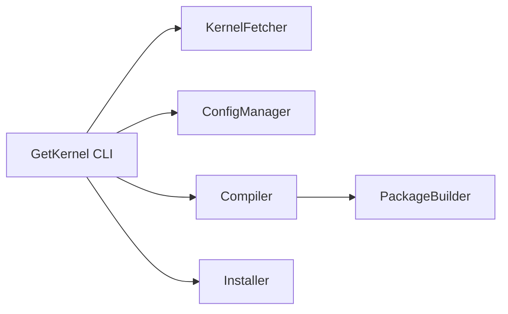

# GetKernel

[](https://github.com/cumakurt/GetKernel/actions/workflows/ci.yml)
[](https://www.gnu.org/licenses/gpl-3.0)
[](https://www.python.org/downloads/)

Debian tabanlı sistemlerde kernel.org üzerinden çekirdek sürümlerini listelemek, isteğe bağlı kaynak indirmek, çalışan çekirdek yapılandırmanızı yeniden kullanmak, `bindeb-pkg` / `deb-pkg` çekirdek paketleri üretmek ve yedekleme kancalarıyla kurmak için Python aracı.

**Diğer dil:** [English — README.md](README.md)

## Gereksinimler

- Python 3.8+
- Debian/Ubuntu/Kali ve benzeri (dpkg/apt)
- Bağımlılık kurulumu, sistem yollarına derleme çıktısı ve paket kurulumu için root veya sudo

## Kurulum

Hızlı kurulum (projeyi `/usr/local/getkernel` altına kopyalar, orada `.venv` oluşturur, `pyproject.toml` üzerinden kurar):

```bash
cd GetKernel
chmod +x install.sh   # gerekirse bir kez
sudo ./install.sh     # isteğe bağlı: sudo ./install.sh --dev  (pytest vb.)
```

**Yönetici (sudo) gerekir.** `./install.sh`’i `sudo` olmadan çalıştırırsanız betik kendini `sudo` ile yeniden çalıştırır ve parola ister.

Eski GetKernel kalıntıları bulunursa (önceki kurulum dizini, sembolik bağlantılar veya kabuk PATH blokları) betik bunları listeler ve silmeden önce onay ister. Onayı atlamak için `--yes` kullanın.

Kurulum betiği dosyaları **`/usr/local/getkernel`** altına yerleştirir ve **`/usr/local/bin/getkernel`** sembolik bağlantısını ekler (PATH’te `/usr/local/bin` olan tüm kullanıcılar için).

Kurulumdan sonra indirilen çekirdek kaynakları, derleme ağaçları, günlükler ve paket çıktıları `/usr/local/getkernel/data/` altında tutulur (cache, builds, logs, packages).

Genel sembolik bağlantı istemezseniz: `sudo ./install.sh --no-symlink` (ardından `source /usr/local/getkernel/.venv/bin/activate` veya `/usr/local/getkernel/.venv/bin/getkernel`).

Manuel kurulum:

```bash
cd GetKernel
python3 -m venv .venv
source .venv/bin/activate
pip install -e .
# isteğe bağlı geliştirici bağımlılıkları (pytest): pip install -e ".[dev]"
```

Üst veri ve bağımlılıklar `pyproject.toml` içinde tanımlıdır (setuptools). Uyumluluk için minimal bir `setup.py` bulunur.

## Mimari (özet)



- **KernelFetcher**: `kernel.org` meta verisi ve tarball indirme, önbellek yeniden kullanımı.
- **ConfigManager**: `.config` dosyasını çalışan çekirdekten veya verdiğiniz dosyadan üretir, ardından `make olddefconfig` / `prepare`.
- **Compiler**: `make` hedefleri (varsayılan `bindeb-pkg`); tam derleme günlüğü `data/logs/build-<id>.log` altına yazılır, uç özet gösterilir.
- **PackageBuilder**: `linux-*.deb` bulur, `data/packages` (veya `--output-dir`) altına kopyalar.
- **Installer**: isteğe bağlı `dpkg` + `apt-get install -f`, initramfs/grub.

## Genel CLI seçenekleri

Alt komuttan önce kullanılır:

| Seçenek | Anlamı |
|---------|--------|
| `--help` / `-h` | `getkernel` veya alt komut için yardım. |
| `--version` | Sürüm ve yazar satırı. |
| `--yes` / `-y` | **Derleme sonrası kurulum** istemlerinde (dpkg) etkileşimsiz onay. |

## Komut özeti

| Komut | Görevi |
|-------|--------|
| *(yok)* veya `interactive` | Adım adım sihirbaz (`getkernel` tek başına çalıştırıldığında varsayılan). |
| `check` | İşletim sistemi, disk, RAM, araç zincirini doğrula. |
| `list` | kernel.org’dan güncel çekirdek sürümlerini listele. |
| `deps` | Eksik derleme paketlerini göster; `--install` ile apt ile kur. |
| `cleanup` | Eski çekirdek paketlerini ve/veya ara derleme dosyalarını temizle. |
| `build` | Tam akış: indir/yapılandır/derle/paketle (isteğe bağlı kur). |
| `prepare` | Yalnızca kaynak indir ve yapılandır (`build --dry-run --skip-install` ile aynı fikir). |
| `about` | Geliştirici adı, e-posta, bağlantılar. |

Tam seçenek listesi için: `getkernel <komut> --help`.

---

## Kullanım — senaryolar ve örnekler

### 1. İlk adımlar: yardım, sürüm ve ortam

```bash
getkernel --help
getkernel --version
getkernel about
```

**`check`** — salt okunur; sudo gerekmez. Uzun bir derlemeden önce disk/RAM/araç zinciri için kullanın:

```bash
getkernel check
```

Engelleyici hatalar varsa çıkış kodu sıfır değildir.

### 2. Uygun çekirdek sürümlerini keşfetme

```bash
getkernel list
```

Sürüm adaylarını (RC) gizlemek için:

```bash
getkernel list --no-rc
```

### 3. Derleme bağımlılıkları

Eksikleri yalnızca görmek (yalnızca inceleme için root gerekmez):

```bash
getkernel deps
```

Aracın ihtiyaç duyduğu paketleri kurmak (root/sudo gerekir):

```bash
sudo getkernel deps --install
```

### 4. Etkileşimli sihirbaz

Yönlendirmeli kullanım için uygundur. Root değilseniz arayüz genelde `sudo` ile yeniden çalıştırmanızı ister:

```bash
python3 GetKernel.py
# veya açıkça:
getkernel interactive
```

**Otomatik sudo yeniden çalıştırmayı atlamak** (ör. otomatik testler — normal masaüstü kullanımı için önerilmez):

```bash
GETKERNEL_NO_ELEVATE=1 python3 GetKernel.py
```

### 5. Varsayılan yapılandırma ile tam derleme (çalışan çekirdekten)

`getkernel list` ile bir sürüm seçin, ardından:

```bash
sudo getkernel build --version 6.12.8
```

Başarılı derlemeden sonra özet ve `.deb` paketlerini kurma sorusu gelir (varsayılan **evet** — Enter onaylar, `n` atlar).

### 6. Derle ama kurma (yalnızca `.deb` üret)

```bash
sudo getkernel build --version 6.12.8 --skip-install
```

Paketleri başka yere kopyalamak veya sonra elle kurmak için uygundur. Çıktılar `data/packages/` altında toplanır (başarı mesajında `latest/` yolu belirtilir).

### 7. Yalnızca kaynak hazırlığı (derleme yok)

Ağaç indirilir/yapılandırılır; `make` paket derlemesi yapılmaz:

```bash
sudo getkernel prepare --version 6.12.8
```

Benzer amaç:

```bash
sudo getkernel build --version 6.12.8 --dry-run --skip-install
```

### 8. Etkileşimsiz oturumlar

**Kurulumu otomatik onayla** (derleme sonrası soru sorma):

```bash
sudo getkernel --yes build --version 6.12.8
```

Ortam değişkeni ile (kurulum onayı için aynı aile):

```bash
GETKERNEL_ASSUME_YES=1 sudo -E getkernel build --version 6.12.8
```

Not: `--yes` / `GETKERNEL_ASSUME_YES` **dpkg kurulum** adımını etkiler; etkileşimli sihirbazdaki her soruyu kapsamaz.

### 9. Özel çekirdek yapılandırması

Çalışan çekirdekten kopyalamak yerine kayıtlı bir `.config` kullanın:

```bash
sudo getkernel build --version 6.12.8 --config /path/to/.config
```

Yalnızca hazır ağaç için `prepare` de `--config` kabul eder:

```bash
sudo getkernel prepare --version 6.12.8 --config /path/to/.config
```

### 10. Yapılandırma parçaları (Kconfig parçaları)

Temel `.config` sonrası bir veya daha fazla parça dosyasını birleştirin (çekirdek ağacındaki `scripts/kconfig/merge_config.sh` kullanılır):

```bash
sudo getkernel build --version 6.12.8 \
  --fragment /path/to/extra.cfg \
  --fragment /path/to/more.cfg
```

Yolları `config/user_config.yaml` içinde `build.config_fragments` altında da listeleyebilirsiniz (`config/fragments/example-debug.cfg` örneğine bakın).

### 11. `localmodconfig` (daha küçük yapılandırma, yüklü modüller)

Yapılandırmayı bu makinede şu an yüklü modüllere indirger (`make localmodconfig`):

```bash
sudo getkernel build --version 6.12.8 --localmodconfig
```

`prepare` ile de kullanılabilir:

```bash
sudo getkernel prepare --version 6.12.8 --localmodconfig
```

### 12. LLVM / Clang ile derleme

Önce `clang` ve `llvm` kurun, sonra:

```bash
sudo getkernel build --version 6.12.8 --llvm
```

Alternatif: `config/user_config.yaml` içinde `build.use_llvm: true`.

### 13. Derleme ilerlemesi (terminal)

Varsayılan olarak GetKernel **canlı ilerleme paneli** gösterir (aşama, yüzde çubuğu, ETA, son işlem). Tam `make` çıktısı her zaman `data/logs/build-<id>.log` dosyasına yazılır.

Tüm `make` satırlarını terminale aktarmak için:

```bash
sudo getkernel build --version 6.12.8 --verbose
```

Minimal çıktı (panel yok; yalnızca log dosyası):

```bash
sudo getkernel build --version 6.12.8 --quiet
```

### 14. `.deb` paketleri için özel çıktı dizini

```bash
sudo getkernel build --version 6.12.8 --output-dir /path/to/debs
```

`prepare`, tam derleme sonrası paketlerin nereye gideceği bilgisinde tutarlılık için `--output-dir` kabul eder.

### 15. Mevcut kaynak ağacı (indirmeyi atla)

Çıkarılmış `linux-*` dizinini (`Makefile` içeren) gösterin:

```bash
sudo getkernel build --version 6.12.8 --source-dir /path/to/linux-6.12.8
```

Paket meta verisi için sürüm dizesini bu ağaçla uyumlu tutun.

### 16. Önceki derlemeden paketleri yeniden kullanma

Aynı sürüm için `getkernel build --version X` tekrar çalıştırıldığında ve `data/packages/latest/` altında eşleşen paketler varsa (`build-info.json` kayıtlı), GetKernel **bunları algılar** ve sunar:

- **[r]ebuild** — baştan tam derleme (varsayılan),
- **[q]uit** — çık.

Depodaki eski paketler **kurulum için sunulmaz**. Yalnızca yeni derleme tamamlandıktan sonra kurulum istemi, **o derlemenin** `.deb` dosyaları için gösterilir.

Bu kontrol şu seçeneklerden biri verildiğinde **atlanır**: `--source-dir`, `--config`, `--fragment`, `--llvm`, `--localmodconfig`, `--force-rebuild`.

**Etkileşimsiz varsayılan:** depoda paket varsa yeniden derler.

**Önbelleği yok sayıp tam derleme:**

```bash
sudo getkernel build --version 6.12.8 --force-rebuild
```

### 17. Temizlik: eski çekirdekler ve derleme artıkları

Sistemdeki eski çekirdek **paketlerini** kaldırır (çalışan çekirdek + `--keep` kadar yeni sürüm kalır; varsayılan `--keep 2`):

```bash
sudo getkernel cleanup --old-kernels
```

Silmeden önizleme:

```bash
sudo getkernel cleanup --old-kernels --dry-run
```

İki yerine daha fazla eski çekirdek tutmak:

```bash
sudo getkernel cleanup --old-kernels --keep 4
```

`data/builds` altındaki ara dosyaları temizler (üretilen paketler korunur):

```bash
sudo getkernel cleanup --build-artifacts
```

Her iki bayrak tek çalıştırmada birlikte verilebilir.

### 18. Yetki özeti

| İşlem | Tipik yetki |
|-------|-------------|
| `check`, `list`, `deps` (`--install` yok), `about`, `--help` | Normal kullanıcı |
| `build`, `prepare`, `deps --install`, `cleanup`, sihirbazda derleme adımları | **root veya sudo** |

Salt okunur komutlar yükseltme gerektirmez. Derleme/kurulum yolları ve `apt`/`dpkg` yönetici hakları bekler.

## Yapılandırma

- `config/default_config.yaml` — projeyle gelen varsayılanlar.
- `config/user_config.yaml` — isteğe bağlı; varsayılanların üzerine birleşir (`config/user_config.yaml.example` dosyasından oluşturun).

Önemli anahtarlar: `paths.*`, `kernel.localversion`, `kernel.reuse_downloads`, `build.jobs`, `build.target`, `build.use_llvm`, `build.localmodconfig`, `build.config_fragments`, `dependencies.auto_install`, `dependencies.install_optional`.

## Ortam değişkenleri

| Değişken | Etki |
|----------|------|
| `GETKERNEL_ASSUME_YES=1` | `--yes` ile aynı aile: derleme sonrası **kurulumu** otomatik onayla. |
| `GETKERNEL_ROOT` | Kurulum/veri kökünü geçersiz kıl (varsayılan: `install.sh` sonrası `/usr/local/getkernel`). |
| `GETKERNEL_NO_ELEVATE=1` | sudo ile yeniden çalıştırmayı yapma (test / özel kurulum). |

## Bilinen sınırlamalar

- `.git` olmayan tarball ağacında **`deb-pkg`** otomatik olarak **`bindeb-pkg`** ile değiştirilir (üst akım `make` kaynak paketleri için git istiyor).
- **Çapraz derleme** desteklenmez; araç yerel araç zinciri varsayar.
- `data/` altındaki disk yolları kurulum köküne göre çözülür (`install.sh` sonrası `/usr/local/getkernel`); YAML’da `paths` veya uygun CLI bayraklarıyla ayarlayın.

## Sorumluluk reddi ve kullanıcı sorumluluğu

GetKernel, **sisteminizi değiştiren** adımları (paketler, `/boot`, initramfs, GRUB, modül ağaçları) otomatikleştirir. Hangi çekirdek sürümü, yapılandırma ve kurulum yolunun donanımınız, iş yükünüz ve dağıtımınız için uygun olduğuna **yalnızca siz** karar verirsiniz.

- **Garanti yok**: Yazılım *olduğu gibi* sunulur. Yazarlar ve katkıda bulunanlar; veri kaybı, önyükleme hataları, bozuk grafik veya sürücüler, güvenlik sorunları, kesinti veya kullanımdan veya kötü kullanımdan doğan her türlü zarar için **sorumlu tutulamaz**.
- **Sizin ortamınız**: **Üçüncü taraf çekirdek modülleri** (NVIDIA, VirtualBox, ZFS, üretici dışı ağaç sürücüler, güvenlik ürünleri vb.), **DKMS** ve **kullanıcı alanı** beklentileriyle uyumluluğu kurulumdan önce ve sonra **doğrulamak sizin** sorumluluğunuzdadır.
- **Yedek ve kurtarma**: Özel çekirdek kurmadan önce yedek alın ve kurtarma yolunu bilin (önyükleme menüsünde önceki çekirdek, canlı USB, anlık görüntü/geri yükleme).

GetKernel’i kullanarak, **risk değerlendirmesinin, testin ve çekirdek değişikliklerinin sonuçlarının tamamen size ait olduğunu** kabul etmiş olursunuz.

## İşletim uyarıları (yaygın kurulum sonrası sorunlar)

Bunlar **herhangi bir** özel çekirdek iş akışında görülebilir; tek başına GetKernel hatası değildir. Önceden plan yapmanız için listelenmiştir.

| Konu | Ne olabilir |
|------|-------------|
| **DKMS** | `linux-image` kurulunca `/etc/kernel/postinst.d/dkms` tetiklenir. Kayıtlı modüllerden **biri** derlemeyi başaramazsa (çoğunlukla çok yeni veya **RC** çekirdeklerde **özel GPU** sürücüleri), **postinst başarısız** olabilir; bağımlılıkları veya modül derlemelerini düzeltene kadar `dpkg` hatalı kalabilir. |
| **NVIDIA / benzeri** | Üretici sürücüler genelde **daha eski, stabil** çekirdek ABI’lerine göre hazırlanır. **Linux 7.x / RC / mainline** iç API’leri sık değiştirir (`mmap`/VMA, kilitleme, semboller). `make.log` içinde *`__is_vma_write_locked` için yanlış argüman sayısı*, *tanımsız `VMA_LOCK_OFFSET`* vb. hatalar, **sürücü sürümünün o çekirdek ile uyumlu olmadığını** gösterir; bunu GetKernel sizin yerinize yama ile çözmez. |
| **`linux-libc-dev`** | Bu metapaketi özel çekirdeğe bağlı bir sürümle değiştirmek, aynı sistemde **kullanıcı alanı derlemelerini** etkileyebilir. Ödünleşmeyi anlayın veya ayrı bir derleme makinesi kullanın. |
| **Secure Boot / imzalama** | Üretici yazılımı, MOK ve imza politikası, imzasız veya kendi imzalı modüller için ek adım gerektirebilir. |
| **Sürüm adayları** | **`-rc`** çekirdekleri **geliştirme** anlık görüntüleridir; dışı ağaç modülleri ve üretim kullanımında **daha fazla kırılma** beklenir. |

**DKMS başarısız olursa:** `/var/lib/dkms/.../build/make.log` dosyasına bakın; sürücü/çekirdek eşlemesini çözün (daha yeni sürücü, daha eski çekirdek, alternatif yığın), ardından uygun şekilde `sudo dpkg --configure -a` ve/veya `sudo apt-get install -f` çalıştırın. **Özel sürücünün başarısını garanti edecek bir çekirdek seçimi GetKernel’den beklemeyin.**

## Geliştirme

```bash
pip install -e ".[dev]"
pytest
```

Çekme istekleri için [CONTRIBUTING.md](CONTRIBUTING.md). Güvenlik bildirimleri: [SECURITY.md](SECURITY.md).

## Yazar

- **Ad:** Cuma KURT  
- **E-posta:** [cumakurt@gmail.com](mailto:cumakurt@gmail.com)  
- **LinkedIn:** [linkedin.com/in/cuma-kurt-34414917](https://www.linkedin.com/in/cuma-kurt-34414917/)  
- **GitHub:** [github.com/cumakurt/GetKernel](https://github.com/cumakurt/GetKernel)

## Lisans

GPL-3.0
